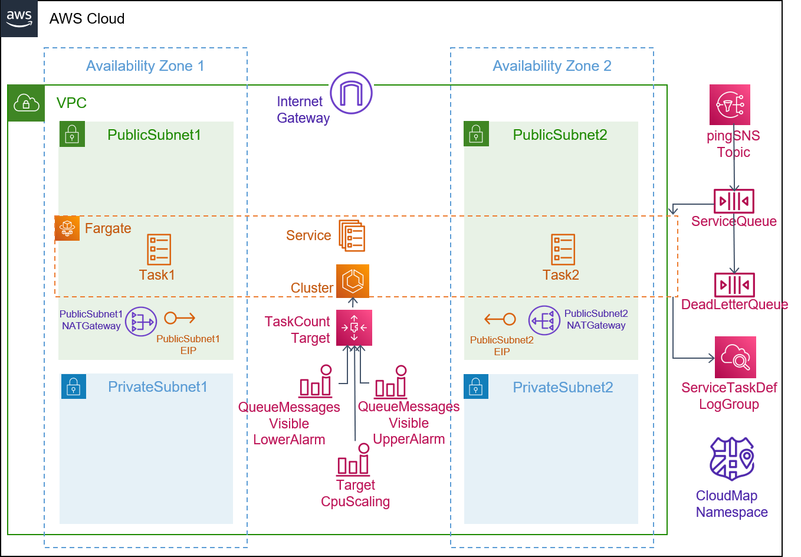
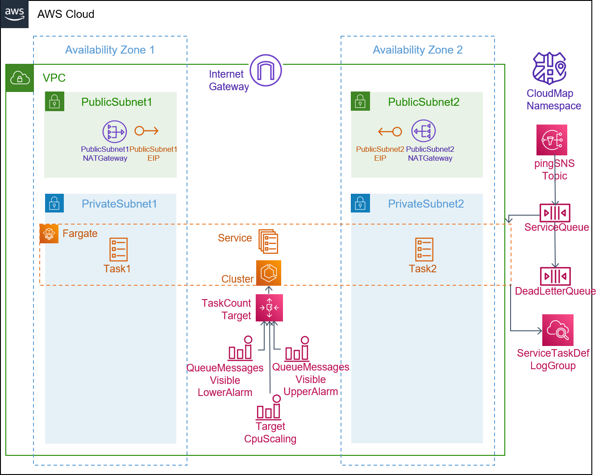

## Description

This template is compatible with the [fargate-env](../../environment-templates/fargate-env) template. It creates a Fargate service that allows you to implement asynchronous service-to-service communication with [pub/sub architectures](https://aws.amazon.com/pub-sub-messaging/). The microservices in your application can publish events to an [Amazon SNS topic](https://docs.aws.amazon.com/sns/latest/dg/welcome.html) that can then be consumed by a "Worker Service". A Worker Service is composed of: 

1. One or more [Amazon SQS queues](https://docs.aws.amazon.com/AWSSimpleQueueService/latest/SQSDeveloperGuide/welcome.html) to process notifications published to the topics, as well as [dead-letter queues](https://docs.aws.amazon.com/AWSSimpleQueueService/latest/SQSDeveloperGuide/sqs-dead-letter-queues.html) to handle failures.
2. An Amazon ECS service running on AWS Fargate that has permission to poll the SQS queues and process the messages asynchronously.

The service can be configured to run in a Public or a Private subnet using the subnet_type parameter. Other properties like desired task count, task size (cpu/memory units), and docker image URL can be specified through the service input parameters. 

The template also provisions a CodePipeline based pipeline to pull your application source code before building and deploying it to the Proton service. To use sample application code, please fork the sample code repository [aws-proton-sample-services](https://github.com/aws-samples/aws-proton-sample-services). By default, the template deploys a [python application](https://github.com/aws-samples/aws-proton-sample-services/tree/main/ecs-worker) that polls the SQS queue for messages, and writes  the message body to CloudWatch logs.   

## Architecture

### Public Subnet

### Private Subnet

## Parameters

### Service Inputs

1. desired_count: The default number of Fargate tasks you want running
2. task_size: The size of the task you want to run
3. subnet_type: Subnet type for your service
4. image: The name/url of the container image

### Pipeline Inputs

1. service_dir: Source directory for the service
2. dockerfile: The location of the Dockerfile to build
3. unit_test_command: The command to run to unit test the application code
4. environment_account_ids: The environment account ids for service instances using cross account environment

## Security

See [CONTRIBUTING](../../CONTRIBUTING.md#security-issue-notifications) for more information.

## License

This library is licensed under the MIT-0 License. See the [LICENSE](../../LICENSE) file.

